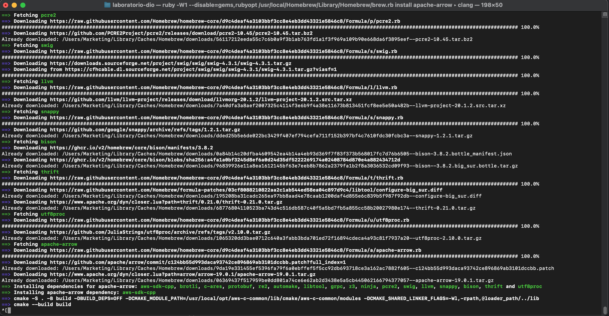

# E-commerce Simples com Streamlit e SQLite 🛒

## Como usar 🔧
- Execute `streamlit run main.py` para iniciar o app.
- Cadastre produtos via interface web.

## Estrutura do Projeto 📁
- `main.py`: Código principal do aplicativo.
- `produtos.sql`: Script do banco de dados.
- `requirements.txt`: Dependências do Python.
Projeto criado durante curso da DIO para aprender Streamlit e SQLite
