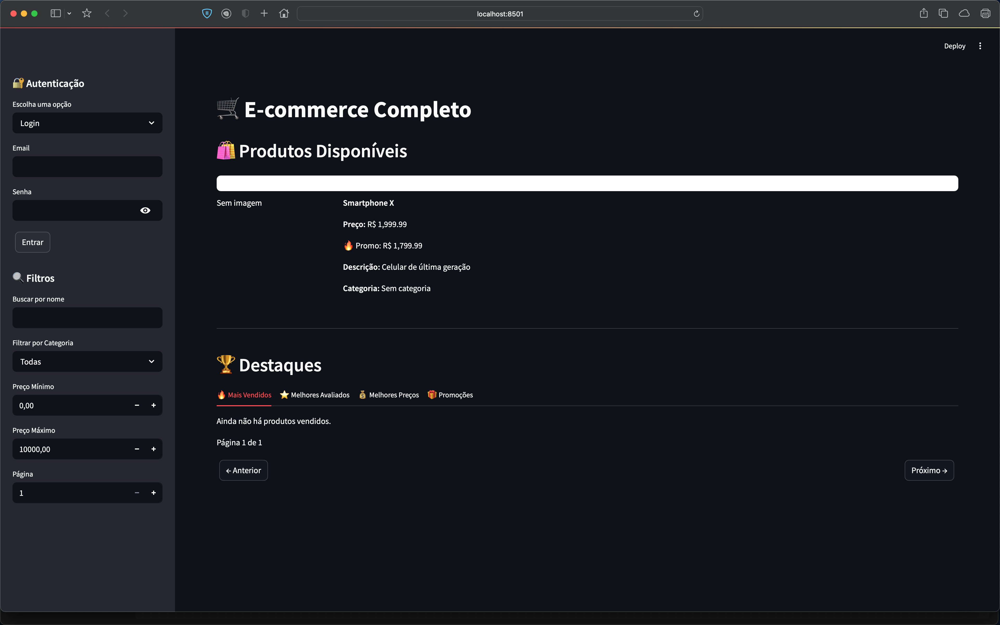
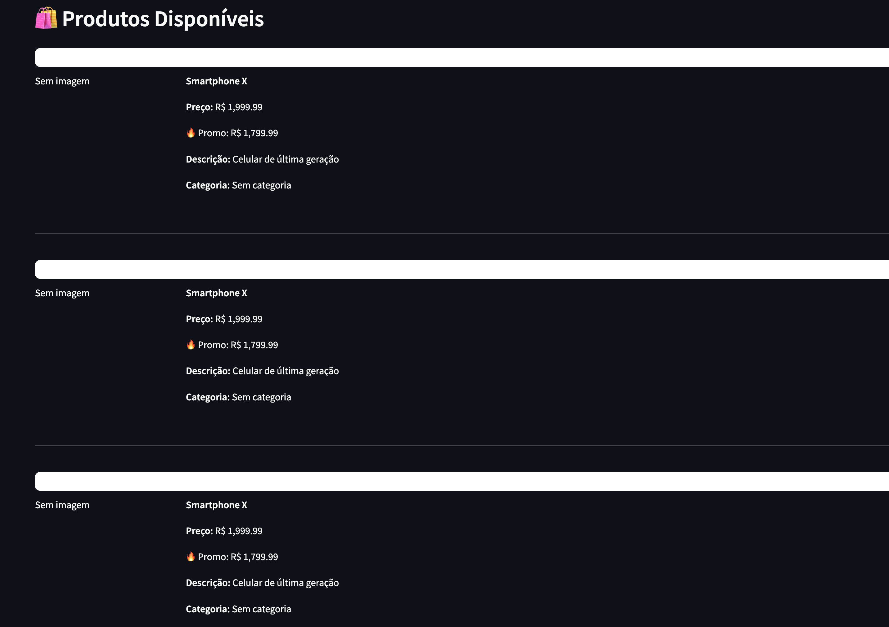
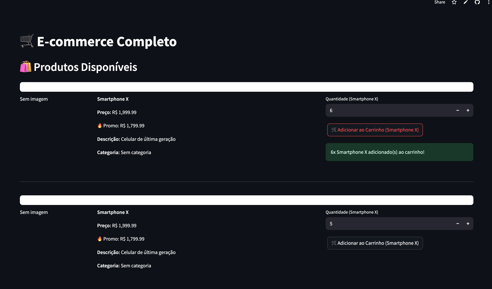
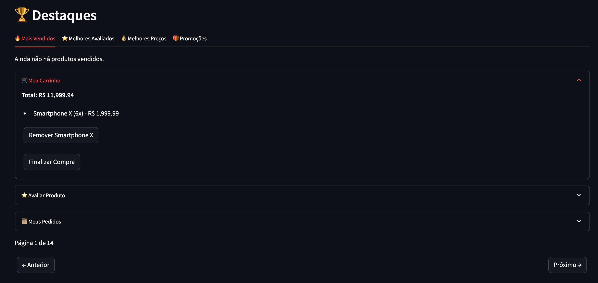

# E-commerce Simples com Streamlit e SQLite 🛒

## Sumário

- [Screenshots](#screenshots)  
- [Como usar](#como-usar)  
- [Estrutura do Projeto](#estrutura-do-projeto)  

## Screenshots

### Página Inicial

### Detalhes do Produto

### Carrinho de Compras

### Checkout

## Como usar
- Execute `streamlit run main.py` para iniciar o app.
- Cadastre produtos via interface web.

## Estrutura do Projeto
- `main.py`: Código principal do aplicativo.
- `produtos.sql`: Script do banco de dados.
- `requirements.txt`: Dependências do Python.
Projeto criado durante curso da DIO para aprender Streamlit e SQLite